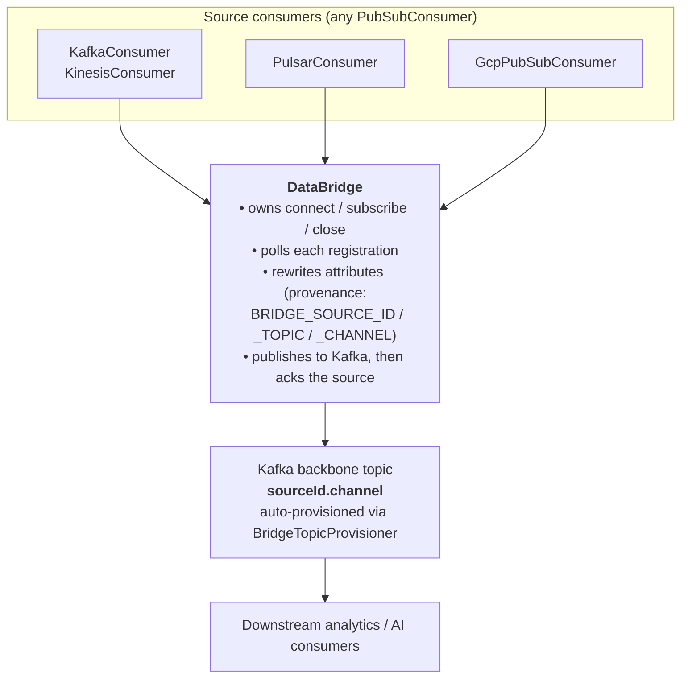

# Unified-data-processing


A Java 17 library that gives every major streaming/pub-sub system the **same**
publisher and consumer API, plus a `DataBridge` that fans heterogeneous sources
into a single Kafka backbone for downstream analytics and AI workloads.

> Status: early development. The unified pub/sub adapters for Kafka, Amazon
> MSK, Apache Pulsar, Google Cloud Pub/Sub, and AWS Kinesis are functional; the
> `DataBridge` orchestrator runs each registration on its own poll thread with
> per-channel topic overrides and at-least-once forwarding.

---

## Table of contents

- [What it does](#what-it-does)
- [Why it exists](#why-it-exists)
- [Why use it](#why-use-it)
- [Supported brokers](#supported-brokers)
- [Architecture](#architecture)
- [Getting started](#getting-started)
- [Usage — publisher & consumer](#usage--publisher--consumer)
- [Usage — DataBridge](#usage--databridge)
- [Building from source](#building-from-source)
- [Testing](#testing)
- [Project layout](#project-layout)
- [Roadmap](#roadmap)
- [License](#license)

---

## What it does

Unified-data-processing is a library (no `main()` — you embed it in your
service) that provides two things:

1. **A single pub/sub abstraction** — `Message`, `PubSubPublisher`, and
   `PubSubConsumer` — implemented for Apache Kafka, Amazon MSK (Kafka with IAM
   / SCRAM auth), Apache Pulsar, Google Cloud Pub/Sub, and AWS Kinesis. Write
   producer/consumer code once; swap brokers by swapping the wiring.
2. **A `DataBridge` orchestrator** that registers any number of source
   consumers (across any mix of brokers) under `(sourceId, channel)` pairs,
   auto-provisions a Kafka topic per pair (`sourceId.channel`), and republishes
   every source message into that Kafka backbone with provenance attributes
   stamped on. Delivery is at-least-once: a source message is only acked once
   its corresponding Kafka publish has been acknowledged.

The result is a uniform Kafka-shaped firehose of every event in your stack —
ready to feed warehouses, lakehouses, feature stores, vector stores, and AI
pipelines.

## Why it exists

Most data platforms end up with the same problem: events live in three or four
different pub/sub systems, each with its own SDK, threading model, ack
semantics, and authentication. Anyone who wants "all the events" — analytics,
ML feature engineering, RAG indexing, real-time AI — has to write a bespoke
ingestion shim per broker, with bespoke retry/ack code each time.

This project exists to:

- Eliminate per-broker boilerplate by hiding each SDK behind one tiny Java
  interface.
- Make it cheap to **bridge** events from any supported broker into a single
  Kafka backbone, so downstream consumers only need to learn Kafka.
- Get the at-least-once semantics, watermark-based acking, and lifecycle
  hygiene right *once*, in one place.

## Why use it

- **One API, five brokers.** `PubSubPublisher` / `PubSubConsumer` look
  identical whether you're talking to Kafka, MSK, Pulsar, GCP Pub/Sub, or
  Kinesis. Test code once, run against any broker.
- **Multi-topic publishing built in.** The topic is read from
  `Message.getTopic()` on every publish — a single publisher instance fans out
  to many topics. Pulsar and GCP Pub/Sub publishers lazily create per-topic
  producers under the hood.
- **At-least-once consumer semantics.** Kafka and Kinesis consumers track
  delivered and acked offsets per partition / shard and only commit / checkpoint
  contiguous prefixes, so gaps in acks don't silently advance the cursor.
- **Aggregate batches (not fail-fast).** `publishBatch(...)` completes only
  when every per-message future has settled and surfaces partial failures via
  `PublishBatchException`, which carries both the succeeded results and an
  index-keyed failure map.
- **Drop-in MSK auth.** `MskPublisherConfig` / `MskConsumerConfig` produce
  Kafka configs preconfigured for IAM or SCRAM-SHA-512.
- **DataBridge for fan-in.** Stand up a Kafka-backed event lake by registering
  source consumers — the bridge handles topic provisioning, lifecycle, message
  rewriting (provenance attributes), and at-least-once forwarding.

## Supported brokers

| Broker            | Publisher | Consumer | Notes                                                         |
| ----------------- | --------- | -------- | ------------------------------------------------------------- |
| Apache Kafka      | ✓         | ✓        | `kafka-clients` 3.7.0. Multi-topic, header passthrough.       |
| Amazon MSK        | ✓         | ✓        | Same as Kafka + IAM (`aws-msk-iam-auth` 2.2.0) / SCRAM auth.  |
| Apache Pulsar     | ✓         | ✓        | `pulsar-client` 3.3.1. Per-topic inner producers/consumers.   |
| Google Cloud Pub/Sub | ✓      | ✓        | `google-cloud-pubsub` 1.131.0. Lazy multi-topic publisher.    |
| AWS Kinesis       | ✓         | ✓        | `kinesis` 2.28.20. PutRecords batching; per-shard throttling. |

All consumers are explicit-ack and poll-based; all publishers expose
single-message, sync, and batch APIs.

## Architecture



### Core types

- `com.unifieddataprocessing.pubsub.Message` — immutable envelope: `id`,
  `topic`, `byte[] payload`, `Map<String,String> attributes`.
- `PubSubPublisher` — `connect`, `publish`, `publishSync`, `publishBatch`,
  `flush`, `close`. Returns `CompletableFuture<PublishResult>` per message.
- `PubSubConsumer` — `connect`, `subscribe`, `unsubscribe`,
  `poll(Duration)`, `acknowledge(Message)`, `close`.
- `PublishResult` — broker-specific factories: `forKafka`, `forGcp`,
  `forKinesis`, `forPulsar`.
- `PublishBatchException` — carries `succeeded: List<PublishResult>` and
  `failures: Map<Integer, Throwable>` (index → cause).

Per-instance publishers and consumers are **not thread-safe** — the underlying
SDK clients are, but the per-instance bookkeeping in each wrapper is not.

## Getting started

### Requirements

- Java 17 or newer
- Maven 3.8+

### Add the dependency

The project is currently `0.1.0-SNAPSHOT` and is not yet published to Maven
Central. Build it locally and install to your local Maven repository:

```bash
git clone https://github.com/brandonkindred/Unified-data-processing.git
cd Unified-data-processing
mvn install
```

Then add it to your project:

```xml
<dependency>
  <groupId>com.unifieddataprocessing</groupId>
  <artifactId>unified-data-processing</artifactId>
  <version>0.1.0-SNAPSHOT</version>
</dependency>
```

## Usage — publisher & consumer

### Publish to Kafka

```java
import com.unifieddataprocessing.pubsub.Message;
import com.unifieddataprocessing.pubsub.PubSubPublisher;
import com.unifieddataprocessing.pubsub.kafka.KafkaProducer;
import com.unifieddataprocessing.pubsub.kafka.KafkaProducerConfig;

KafkaProducerConfig cfg = new KafkaProducerConfig("broker-1:9092,broker-2:9092");
// Or with extra Kafka client props:
// new KafkaProducerConfig("broker-1:9092", Map.of(ProducerConfig.ACKS_CONFIG, "all"));

try (PubSubPublisher pub = new KafkaProducer(cfg)) {
  pub.connect();

  Message m = new Message(
      "evt-123",
      "user.signups",
      "{\"userId\":\"u1\"}".getBytes(),
      Map.of("kafkaKey", "u1", "schema", "v1"));

  pub.publishSync(m);
}
```

The reserved attribute `kafkaKey` becomes the Kafka record key; all other
attributes are emitted as record headers.

### Publish to Amazon MSK

```java
import com.unifieddataprocessing.pubsub.msk.MskPublisherConfig;

KafkaProducerConfig cfg = MskPublisherConfig.iamAuth(
    "b-1.cluster.kafka.amazonaws.com:9098", "us-east-1");
// or: MskPublisherConfig.saslScram(bootstrap, username, password);
PubSubPublisher pub = new KafkaProducer(cfg);
```

### Consume from Kafka

```java
import com.unifieddataprocessing.pubsub.PubSubConsumer;
import com.unifieddataprocessing.pubsub.kafka.KafkaConsumer;
import com.unifieddataprocessing.pubsub.kafka.KafkaConsumerConfig;
import java.time.Duration;

KafkaConsumerConfig cfg = new KafkaConsumerConfig("broker-1:9092", "my-app");

try (PubSubConsumer consumer = new KafkaConsumer(cfg)) {
  consumer.connect();
  consumer.subscribe("user.signups");

  while (running) {
    for (Message m : consumer.poll(Duration.ofSeconds(1))) {
      handle(m);
      consumer.acknowledge(m); // commits the contiguous prefix
    }
  }
}
```

### Other brokers

The shape is identical — only the constructors change:

```java
new com.unifieddataprocessing.pubsub.pulsar.PulsarPublisher(pulsarPubCfg);
new com.unifieddataprocessing.pubsub.gcp.GcpPubSubPublisher(gcpPubCfg);
new com.unifieddataprocessing.pubsub.kinesis.KinesisPublisher(kinesisPubCfg);

new com.unifieddataprocessing.pubsub.pulsar.PulsarConsumer(pulsarConsCfg);
new com.unifieddataprocessing.pubsub.gcp.GcpPubSubConsumer(gcpConsCfg);
new com.unifieddataprocessing.pubsub.kinesis.KinesisConsumer(kinesisConsCfg);
```

Notes:

- **Pulsar publisher** caches one producer per topic; `flush()` drains all of
  them.
- **Pulsar consumer** with multiple subscriptions creates one inner Pulsar
  consumer per topic (Pulsar can't add/remove topics on an existing consumer)
  and round-robins polls with per-consumer budgets.
- **GCP Pub/Sub publisher** lazily creates a `Publisher` per topic; the
  consumer is bound to a single subscription (set in
  `GcpPubSubConsumerConfig`).
- **Kinesis publisher** reads the partition key from the reserved
  `ATTR_PARTITION_KEY` attribute (falling back to `Message.getId()`) and uses
  `PutRecords` for batches (chunked to ≤500).
- **Kinesis consumer** does one-time shard discovery, throttles per shard
  (5 TPS / 2 MiB/s) and tracks ack watermarks per shard. For production
  resharding/lease management, prefer a KCL-based implementation.

### Batch publishing

```java
CompletableFuture<List<PublishResult>> f = publisher.publishBatch(messages);
try {
  List<PublishResult> ok = f.join();
} catch (CompletionException ce) {
  if (ce.getCause() instanceof PublishBatchException pbe) {
    List<PublishResult> partial = pbe.getSucceeded();
    Map<Integer, Throwable> failed = pbe.getFailures();
    // ... handle partial success
  }
}
```

Batches are aggregate, not fail-fast — a failure on message *i* does not
prevent messages *j ≠ i* from succeeding.

## Usage — DataBridge

`DataBridge` is the orchestration layer. Register source consumers, call
`start()`, and the bridge will:

1. Provision a Kafka topic `sourceId.channel` per registration (idempotent —
   existing topics are accepted).
2. Connect the Kafka publisher and every source consumer.
3. Poll each source on a single executor, round-robining across
   registrations.
4. Stamp `BRIDGE_SOURCE_ID`, `BRIDGE_SOURCE_TOPIC`, and `BRIDGE_CHANNEL`
   attributes onto every message (see `BridgeAttributes`).
5. Publish to the corresponding Kafka topic, wait up to `publishTimeout`, and
   only then `acknowledge(...)` on the source consumer (at-least-once).

```java
import com.unifieddataprocessing.pubsub.PubSubConsumer;
import com.unifieddataprocessing.pubsub.bridge.ChannelOptions;
import com.unifieddataprocessing.pubsub.bridge.DataBridge;
import com.unifieddataprocessing.pubsub.bridge.DataBridgeConfig;
import com.unifieddataprocessing.pubsub.gcp.GcpPubSubConsumer;
import com.unifieddataprocessing.pubsub.gcp.GcpPubSubConsumerConfig;
import com.unifieddataprocessing.pubsub.kafka.KafkaConsumer;
import com.unifieddataprocessing.pubsub.kafka.KafkaConsumerConfig;
import com.unifieddataprocessing.pubsub.kafka.KafkaProducerConfig;

KafkaProducerConfig producerCfg = new KafkaProducerConfig("kafka:9092");

DataBridgeConfig cfg = DataBridgeConfig.builder()
    .producerConfig(producerCfg)
    .defaultPartitions(3)
    .defaultReplicationFactor((short) 3)
    .build();

// Each registered consumer must be freshly constructed — the bridge owns
// connect/subscribe/close. Do NOT call those methods yourself.
PubSubConsumer shopifyConsumer = new GcpPubSubConsumer(
    new GcpPubSubConsumerConfig("my-gcp-project", "shopify-orders-sub"));
PubSubConsumer salesforceConsumer = new KafkaConsumer(
    new KafkaConsumerConfig("source-kafka:9092", "salesforce-leads-bridge"));

try (DataBridge bridge = new DataBridge(cfg)) {
  bridge.register(
      "shopify",                   // sourceId  (no '.' allowed)
      "orders",                    // channel   -> Kafka topic "shopify.orders"
      "shopify-orders-sub",        // sourceTopic on the source broker
      shopifyConsumer,
      ChannelOptions.builder().partitions(6).build());

  bridge.register(
      "salesforce",
      "leads",                     //           -> Kafka topic "salesforce.leads"
      "leads-stream",
      salesforceConsumer,
      ChannelOptions.defaults());  // uses defaultPartitions / defaultReplicationFactor

  bridge.start();
  // ... bridge polls + republishes in the background ...
}                                  // close() flushes and closes everything
```

### Bridge semantics

1. **At-least-once delivery.** A source message is acked only after the bridge's
   Kafka publish has been confirmed within `publishTimeout`. If the publish
   times out or fails, the source is **not** acked, so a restart or rebalance
   redelivers the record from the source's last-committed cursor.
2. **Authoritative provenance headers.** The bridge stamps every published
   message with `bridge.sourceId`, `bridge.sourceTopic`, and `bridge.channel`
   (via `put`, overwriting any caller-supplied values). The string keys are
   exposed as `BridgeAttributes.BRIDGE_SOURCE_ID` / `_SOURCE_TOPIC` / `_CHANNEL`
   — downstream consumers can trust them.
3. **Per-message ack precondition.** `PubSubConsumer.acknowledge(m)` must
   commit only `m`, not any message delivered after it. Backends with
   all-up-to-N ack semantics are unsupported (they would silently advance the
   cursor past an unacked record).
4. **Freshly-constructed-consumer precondition.** Each `PubSubConsumer`
   instance you pass to `register(...)` must be newly constructed. Do **not**
   call `connect()`, `subscribe()`, or `close()` on it before registration —
   the bridge owns the entire lifecycle and will fail loudly if a consumer is
   already connected.
5. **`sourceId` cannot contain `.`.** `sourceId` must match
   `^[a-zA-Z0-9_-]+$`; `channel` may contain `.` (`^[a-zA-Z0-9._-]+$`). This
   keeps the prefix in the derived topic name `<sourceId>.<channel>`
   unambiguous, so two different registrations can never derive the same
   Kafka topic.
6. **Single consumer instance per registration.** Registering the same
   `PubSubConsumer` instance twice is rejected at `register()` time
   (identity check). Build one consumer per registration.

`register(...)` must be called before `start()`, and `start()` is once-only.
`close()` is synchronized and idempotent: it shuts down the per-registration
executor (graceful `shutdownTimeout` then forced `closeForceTimeout`), flushes
the publisher, then closes every consumer and the publisher.

## Building from source

```bash
mvn clean verify
```

This compiles, runs the unit tests via Surefire (JUnit 5 + Mockito), and
packages the JAR. Checkstyle (`google_checks.xml`, warning-severity) and
SpotBugs (Max effort, Medium threshold, excludes in `spotbugs-exclude.xml`)
are configured but **not bound to a lifecycle phase**, so `mvn verify`
does not run them — invoke their goals explicitly, matching CI:

```bash
mvn checkstyle:check          # lint
mvn compile spotbugs:check    # static analysis (needs compiled classes)
```

Quick iteration:

```bash
mvn -DskipTests package       # build a JAR
mvn test                      # tests only
```

## Testing

Unit tests live under `src/test/java/` and cover every adapter plus the
bridge. They use:

- JUnit Jupiter 5.10.2
- Mockito 5.11.0 (`mockito-core`, `mockito-junit-jupiter`)
- In-memory stubs `PubSubPublisherStub` and `PubSubConsumerStub` for
  cross-broker behavior tests.

No external broker is required for the test suite.

## Project layout

The library is organized as one core pub/sub module plus a per-broker adapter
module for each supported broker, with the `bridge` package on top:

```
src/main/java/com/unifieddataprocessing/pubsub/
├── Message.java                       core envelope
├── PubSubPublisher.java               publisher interface
├── PubSubConsumer.java                consumer interface
├── PublishResult.java                 per-message ack metadata
├── PublishBatchException.java         aggregate batch failure
├── PubSubPublisherStub.java           in-memory test double
├── PubSubConsumerStub.java            in-memory test double
├── bridge/                            DataBridge + helpers
│   ├── DataBridge.java
│   ├── DataBridgeConfig.java
│   ├── Registration.java
│   ├── BridgeAttributes.java          BRIDGE_SOURCE_ID/_TOPIC/_CHANNEL keys
│   ├── BridgeTopicProvisioner.java    Kafka AdminClient wrapper
│   ├── MessageRewriter.java           stamps provenance attributes
│   ├── ChannelOptions.java
│   ├── NewTopicSpec.java
│   └── Sleeper.java
├── kafka/                             KafkaProducer/Consumer + configs
├── msk/                               MSK IAM / SCRAM config factories
├── gcp/                               GCP Pub/Sub publisher/consumer
├── pulsar/                            Pulsar publisher/consumer
└── kinesis/                           Kinesis publisher/consumer
```

## Roadmap

Near-term follow-ups tracked in the issue tracker:

- Cap unacked-message bookkeeping in `DataBridge` during prolonged publish
  outages so cursor-based sources (e.g. `KafkaConsumer`) don't grow unbounded
  in-memory state.
- KCL-based Kinesis consumer for production resharding / lease management.
- Kafka → external publisher relay (the downstream half of the bridge).

## License

See [LICENSE](LICENSE).

---

## Topics

`java` · `maven` · `kafka` · `amazon-msk` · `apache-pulsar` · `google-pubsub` · `aws-kinesis` · `pubsub` · `event-streaming` · `stream-processing` · `data-pipeline` · `analytics` · `ai`
